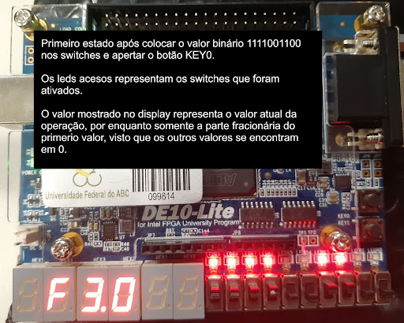
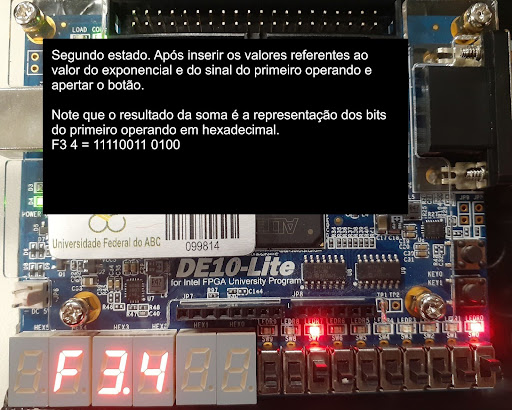
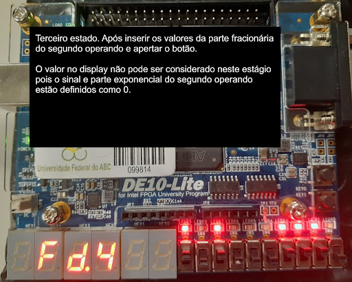
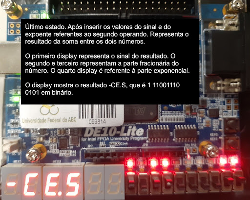

# Projeto calculadora de ponto flutuante em FPGA
Análise de uma implementação do sistema de somador de ponto flutuante simplificado em VHDL originalmente desenvolvido para ser utilizado no FPGA Xilinx Spartan 3.
O código foi adaptado para que seja funcional em um FPGA DE10-Lite. Adaptado de CHU, P. P. FPGA Prototyping by VHDL Examples: Xilinx Spartan-3 Version

O sistema é capaz de realizar a soma de dois números em nível de hardware, demonstrando conceitos básicos do processo de design de sistemas digitais.

A representação de número de ponto flutuante escolhida utiliza um bit para o sinal do número, quatro bits para o expoente e oito bits para a mantissa.
O valor do número é obtido pela expressão (-1)s * .𝑓 * 2e, onde “s” é o bit do sinal, 𝑓 é a mantissa e “e”, o expoente.
Os valores de “s” e “e” são convertidos para decimal e 𝑓 para decimal com base no valor fracionário em binário.

Para realizar a entrada desses dados são necessários 26 bits no total. Um jeito prático de se conseguir isso é utilizando os switches da placa DE10-Lite.
Dividimos a entrada em quatro partes: a mantissa e expoente de cada operando. A placa dispõe de dez switches, sendo mais do que suficiente para representar cada uma das entradas individualmente.
São utilizados os oito primeiros switches da esquerda para a direita para a entrada de dados e os dois últimos atuam como variáveis seletoras para a escolha de qual input está sendo considerado de acordo com a tabela:

| SW(1) | SW(0) | Input |
|-------|-------|----------|
| 0     | 0     | frac1 SW(9 downto 2)   |
| 0     | 1     | sign1 SW(9), exp1 SW(8 downto 5)   |
| 1     | 0     | frac2 SW(9 downto 2)   |
| 1     | 1     | sign2 SW(9), exp2 SW(8 downto 5)   |

Após os dados serem inseridos, o usuário realiza o pressionamento do botão na placa para que o cálculo possa ser realizado.
O resultado é mostrado no display de sete segmentos na forma hexadecimal. O primeiro display, da esquerda para a direita, representa o sinal do resultado, sendo apagado para positivo e “-” para negativo.
O segundo display representa o expoente, o terceiro e quarto display, a mantissa.

## Funcionamento

